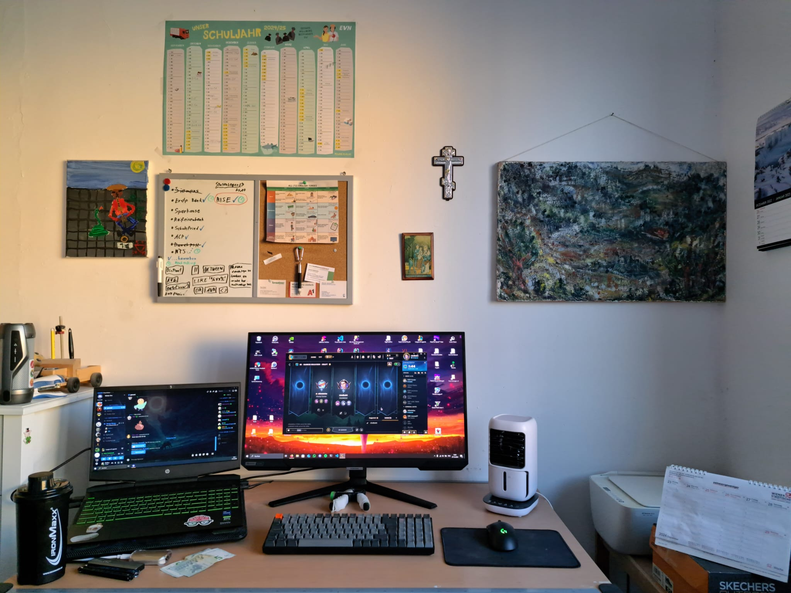

This is my current workspace. I designed it to be both calming and beautiful while also being modern and minimalistic:

That's my **stuff**:
- Laptop: HP Pavilion Gaming Laptop (modded specs, secret 🙃) 
	- OS: Windows and Linux 😎
- Monitor: Samsung Odyssey G4 (1080p @240Hz) 
- Keyboard: Keychron K4
- Mouse: Logitech G Pro Wireless
- Fan: Noname but cool and it has a light :)

You can also notice I **decorated the wall** a little. Let's talk about it:
	The **right picture** was drawn by my grandfather, who was an artist. The **picture to the very left**, I drew myself, as you might assume by the excellence of it.
	I got the picture of the **Holy Family in Egypt** from church. The **silver cross** was a gift from my cousin (also got it from church).

Also I have got the big **Calendar** from [EVN](https://www.evn.at/), which I personally requested and was granted exclusive access on :D It's really helpful as it grants me a perfect overview on all my exams.

As you might have recognized I got a little forearm training device which I use while Coding or if I'm just bored... #neverStopTrining 💪

This post surely can help you if you are currently seeking inspiration for your own setup. If it did help you, I would be happy if you let me know and maybe show me a pic of your setup 📸✌️ 