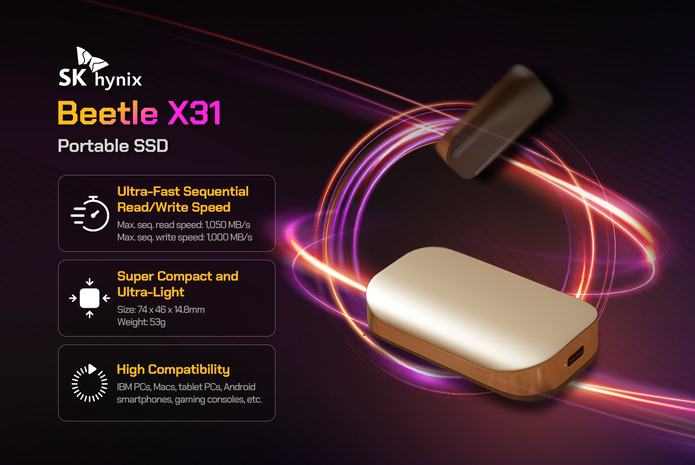
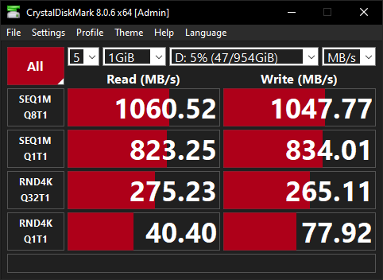

## Introduction
Yesterday my Beetle X31 SSD was delivered. I ordered it because it was heavily discounted on the black friday sale (**70€**). I ordered the **1TB** Version to extend my external storage possibility as far as possible.
## Product

## Package Content
Inside the package was:
- The SSD itself
- A protective case for the SSD
- Two extra _thicc_ USB 3.0 cables:
	- USB type C - USB type C cable
	- USB type C - USB type A cable
- A little manual #skipthetutorial 🙃
## Benchmarks
As soon as it arrived, I ran a few benchmark tests on the external SSD. Here are the results:

... And yes, I used Windows 4 this

As you can see, the results are really great and the Beetle X31 SSD is performing as advertised.
## Conclusion
The Beetle X31 SSD is a high performing external SSD at a low price range. I totally recommend buying it, especially when in discount. 